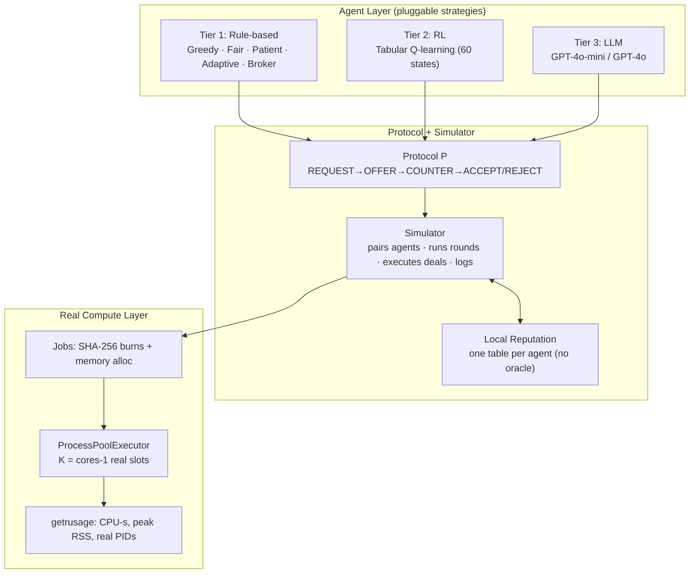
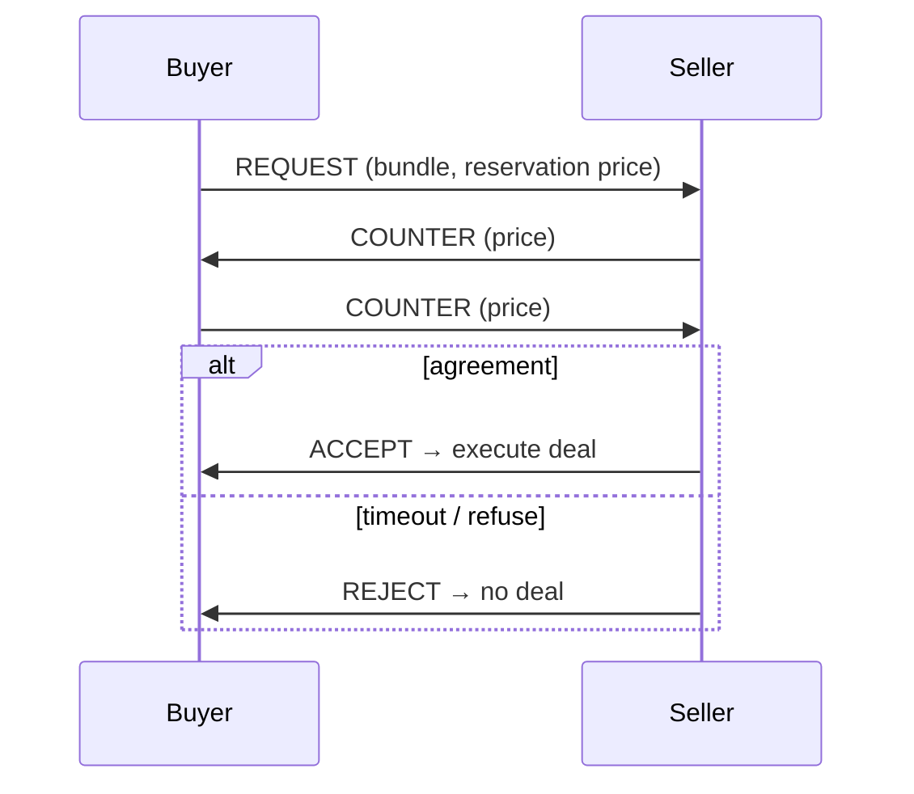

# Slide Deck Content — Decentralized Compute Negotiation Across Agent Intelligence Tiers

> **How to use this doc:** Paste the whole thing into Claude and ask it to build a technical slide deck (HTML/React artifact or PPTX). Every slide below has a title, the exact content/bullets, and a **Visual** note describing the diagram or chart to render. All numbers are final — no lookups needed.

---

## DESIGN DIRECTION (read first)

- **Audience:** Technical — frontier AI researchers / systems engineers. Assume they know game theory, RL, and LLMs. Do not dumb down.
- **Tone:** Rigorous, confident, data-forward. Findings-first. Let the numbers carry it.
- **Aesthetic:** Dark technical theme. Monospace for code/metrics, clean sans for prose. Accent color for key metrics. Think "research lab keynote," not "startup pitch."
- **Diagrams:** Use Mermaid where specified (architecture, protocol flow, pipelines). Use real charts (bar/line) for results — data provided inline per slide.
- **Density:** One idea per slide. Headline states the finding; body proves it. Put a one-line "takeaway" at the bottom of each results slide.
- **Length:** ~26 slides. Section dividers between the 5 acts: Motivation → System → Method → Findings → Implications.
- **Consistency:** Number the findings F1–F6 and keep those labels everywhere.

---

## SECTION 1 — MOTIVATION

### Slide 1 — Title
- **Title:** Emergent Market Dynamics in Decentralized Compute Negotiation
- **Subtitle:** How rule-based, RL, and LLM agents behave when they bargain for real compute — with no central scheduler
- **Author:** Shubham Mookim
- **Footer chips:** 15 experiments · 15,000+ trials · real hardware · < $0.03 API cost
- **Visual:** Minimal. Title on dark background, subtle grid or node-graph motif suggesting a peer-to-peer network.

### Slide 2 — The Problem
- **Headline:** Compute is the scarce resource of the AI era — and agents are starting to buy it themselves.
- Bullets:
  - Agentic AI market ≈ $7.3B (2025); 20,000+ autonomous agents on decentralized infra by early 2026.
  - Agents now have economic agency (x402, AgenticPay payment protocols).
  - Decentralized compute markets exist today: Akash, Render, io.net.
  - **But:** they keep a centralized core — a matching engine + oracle pricing.
- **Takeaway:** What happens when the *matching and pricing themselves* are decentralized — emerging from agents bargaining directly?
- **Visual:** Left = centralized (star topology, one scheduler in middle). Right = decentralized (mesh, agents negotiating peer-to-peer). Contrast the two.

### Slide 3 — The Gap
- **Headline:** Nobody has put all three agent intelligence tiers in one compute market.
- Three gaps, as a table:
  | Prior work | What it does | What it misses |
  |---|---|---|
  | NegotiationArena, Game-Theoretic LLM | LLM vs LLM in abstract games | No rule/RL tiers, no compute, no real stakes |
  | Akash / io.net / blockchains | Infra + incentives | No agent-level negotiation dynamics |
  | Multi-agent RL | Emergent behavior | Rarely economic markets w/ mixed intelligence |
- **Takeaway:** We are the first to (i) mix rule/RL/LLM in one market, (ii) benchmark against bargaining theory, (iii) ground it in real hardware.
- **Visual:** The 3-row table, with the "What it misses" column highlighted in the accent color.

### Slide 4 — Research Questions
- **Headline:** Six questions.
- **RQ1 Compatibility** — which strategies can close deals at all?
- **RQ2 Equilibrium** — how far from the Rubinstein / Nash optimum do agents land?
- **RQ3 Tier comparison** — does more intelligence mean better outcomes?
- **RQ4 Trust** — can decentralized reputation catch cheaters, and where does it fail?
- **RQ5 Real allocation** — does LLM bidding for *real* slots match centralized scheduling? Is it manipulable?
- **RQ6 Scale & model** — do findings survive bigger populations and different LLMs?
- **Visual:** Six numbered cards in a 2×3 grid, each with a one-word tag.

---

## SECTION 2 — SYSTEM

### Slide 5 — System Architecture (the big one)
- **Headline:** A pluggable negotiation framework with a real-compute execution layer.
- **Visual (Mermaid):**

- **Takeaway:** Strategies are swappable; the same market runs abstract negotiation AND real hardware contention.

### Slide 6 — The Negotiation Protocol
- **Headline:** A minimal alternating-offers vocabulary — 10 message types, 5 core.
- Core: **REQUEST → OFFER → COUNTER → ACCEPT / REJECT**
- Trust/execution: QUERY_REPUTATION, REPUTATION_RESPONSE, ALLOCATE, RELEASE, **DEFAULT** (cheating)
- **Visual (Mermaid sequence):**

- **Takeaway:** Capped at T_max turns; hitting the cap = disagreement. This is a finite-horizon Rubinstein game.

### Slide 7 — The Formal Model
- **Headline:** A decentralized compute market is a tuple.
- **Center (monospace):** `M = ⟨ N, R, {Uᵢ}, {Bᵢ}, {uᵢ}, {θᵢ}, P, {Repᵢ} ⟩`
- Legend:
  - `N` agents · `R` = {GPU, CPU, MEM} resource-hours
  - `Uᵢ(L,p) = vᵢ(L) − p` quasi-linear utility · `Bᵢ` budget · `uᵢ` urgency
  - `θᵢ ∈ {rule, RL, LLM}` intelligence tier
  - `P` protocol · `Repᵢ: N→[0,1]` **local** reputation (one per agent — the decentralization commitment)
- **Needs-based utility** (fixes wealth's "reward for abstaining" flaw):
  `Û = 0.7·(acquired/requested) + 0.3·min(fair_value/price_paid, 1)`
- **Takeaway:** Urgency maps to Rubinstein impatience: `δᵢ = 1 − κ·uᵢ`.
- **Visual:** The tuple large and centered; legend as a clean two-column list. Sidebar box for Û.

### Slide 8 — Three Intelligence Tiers
- **Headline:** Same market, three kinds of mind.
- Table:
  | Tier | Agent | Mechanism | Key param |
  |---|---|---|---|
  | 1 | Greedy | reservation-price threshold | greed g=0.7 |
  | 1 | Fair | target market price, split diff | tol τ=0.15 |
  | 1 | Patient | wait for bargains, decay | ρ=0.8 |
  | 1 | Adaptive | EMA price belief (learns in-run) | α=0.2 |
  | 2 | Q-learning | 60-state table, ε-greedy 0.40→0.05 | γ=0.9 |
  | 3 | LLM | GPT-4o-mini/4o, temp 0.3 | naive vs engineered prompt |
- **Visual:** The table, tier column color-banded (T1 / T2 / T3 distinct accent shades).

### Slide 9 — Real Compute Execution Layer
- **Headline:** Not a simulation of compute — actual CPU and memory burned.
- Bullets:
  - `cpu_burn`: chains SHA-256 hashes (returns digest so it can't be optimized away). 258K–1.29M iterations/job.
  - `mem_burn`: allocates + page-touches real memory, 8–128 MB.
  - Runs in `ProcessPoolExecutor`, K = (cores−1) real slots → genuine contention.
  - Measured via `getrusage`: real wall time, CPU-seconds, peak RSS, OS PIDs.
  - Auto-calibrated to ~0.3s/job so results port across hardware.
- **Takeaway:** This discharges the "abstract units" critique — allocation decisions move real work.
- **Visual:** A job-lifecycle strip: `Job → queue → [3 slots busy] → getrusage metrics`. Show 4 job archetypes (short_urgent, long_batch, medium_mixed, mem_heavy) as colored blocks of different sizes.

---

## SECTION 3 — METHOD

### Slide 10 — Experimental Methodology
- **Headline:** Every claim is a mean over 200–1000 seeded trials with 95% CIs.
- Bullets:
  - Welch's t-test (unequal variance), Cohen's d effect sizes, Gini for inequality.
  - Single audited stats module (`agents/stats.py`) — conclusion-validity safeguard.
  - Hard API call-budget guard: raises before exceeding preset call count → deterministic cost bound.
  - Everything seeded; non-LLM experiments are bit-reproducible.
  - Per-trial artifacts dumped to `results/` (real PIDs, CPU-s, LLM bids).
- **Metrics defined:** deal rate · wealth Δ · needs-utility Û · price-deviation-from-SPE · social welfare · urgent latency · makespan · fairness (σ wait) · detection rate/latency.
- **Takeaway:** Total API spend for ALL LLM experiments: **under $0.03.**
- **Visual:** A "methodology at a glance" panel — icons for {trials, CIs, seeds, cost guard, artifacts}.

---

## SECTION 4 — FINDINGS (the core)

### Slide 11 — Section divider: 6 Findings
- **Headline:** What we found.
- List F1–F6 as a teaser index:
  - F1 Strategy deadlocks are the default
  - F2 Intelligence tiers invert
  - F3 Reputation has a 30% blind spot
  - F4 LLMs reconstruct scheduling from scratch
  - F5 Prompt engineering is a trap
  - F6 One adversarial prompt breaks the market
- **Visual:** Six-item vertical index, each with its finding number in a large accent numeral.

### Slide 12 — F1: Strategy Deadlocks
- **Headline:** Only 4 of 16 strategy pairs can close a deal — and it's deterministic.
- **Data (compatibility matrix, deal rate over 1000 trials each):**
  | Buyer \ Seller | Greedy | Fair | Patient | Adaptive |
  |---|---|---|---|---|
  | Greedy | 0% | 0% | 0% | 0% |
  | Fair | 0% | **100%** | 0% | **100%** |
  | Patient | 0% | 0% | 0% | 0% |
  | Adaptive | 0% | **100%** | 0% | **100%** |
- Zero variance across 1000 trials. Greedy & Patient deadlock against everyone, incl. themselves.
- **Takeaway:** Deal formation isn't emergent luck — it's structural compatibility. Robust across a 9×9 parameter sweep.
- **Visual:** Render the matrix as a 4×4 heatmap (green=100%, dark=0%).

### Slide 13 — F2: Intelligence Tier Inversion
- **Headline:** The simplest agent wins. More intelligence ≠ better outcomes.
- **Data — wealth Δ (5-agent market, 300 rounds):**
  Greedy (T1) **+48.7** · Patient (T1) −0.9 · RL-fresh (T2) −2.3 · RL-pretrained (T2) −2.9 · Fair (T1) −5.1 · Adaptive (T1) −15.2
  (Greedy ≫ RL: t=−166.7, p<0.001, d=−23.6)
- **Under needs-utility Û** (fixes the "abstaining = winning" flaw): Greedy 0.415 > RL 0.387 > Patient 0.386 > Fair 0.382 > Adaptive 0.362. **Inversion persists.**
- RL overfits: transferred agents underperform native ones (d=−0.30, p=0.037).
- **Takeaway:** In bilateral markets the optimal policy is a fixed reservation price. Greedy approximates it by accident.
- **Visual:** Horizontal bar chart of wealth Δ, tier-colored bars, Greedy's bar dramatically longer and highlighted.

### Slide 14 — F3: The 30% Detection Threshold
- **Headline:** Below a 30% cheat rate, dishonest agents are invisible to reputation.
- **Data (500 trials/rate):**
  | Cheat rate | Detection | Final reputation |
  |---|---|---|
  | 5% | 0% | 0.883 |
  | 10% | 0% | 0.792 |
  | 20% | 5% | 0.570 |
  | **30%** | **39%** | 0.348 |
  | 50% | 97% | 0.109 |
  | 100% | 100% | 0.001 |
- Max detection slope = 4.70 (sharp phase transition). Below 20%, reputation *rises* over time.
- Gossip helps but doesn't fix it: 0%→14% at 10% rate (d=0.90). Adaptive cheater caught only 7%.
- **Why (closed form):** additive update drift = `0.1(1−q) − 0.3q = 0.1 − 0.4q`, positive for q<0.25 → reputation trends UP regardless of cheating.
- **Takeaway:** ANY additively-updated reputation system has a mathematical blind spot. Markets need stake/crypto commitment, not reputation alone.
- **Visual:** Line chart — x=cheat rate, y=detection %, with a vertical marker at 30% and the phase-transition steep segment highlighted. Inset: the drift equation.

### Slide 15 — F4: LLMs Reconstruct Scheduling From Scratch
- **Headline:** Given only job descriptions, an LLM independently rebuilt near-optimal scheduling.
- **Data — social welfare on identical real workloads:**
  FIFO 13.5 · Market 20.7 · Urgency (centralized) 25.3 · **LLM 25.0** (urgent latency tied at 0.18s)
- The LLM was NOT told scheduling theory. It bid 70–98 for urgent jobs, 1–15 for batch jobs — reconstructing urgency-priority.
- Cost: 36 calls, $0.0014.
- **Takeaway:** LLMs are weak at adversarial bargaining but strong at one-shot prioritization. Task structure, not raw IQ, decides when intelligence helps.
- **Visual:** Grouped bar chart (welfare by regime), LLM bar right next to centralized Urgency, near-identical height, both highlighted.

### Slide 16 — F5: The Prompt Engineering Paradox
- **Headline:** Making each agent more rational destroyed the market.
- Two columns:
  - **Naive prompt:** 100% deal rate vs Greedy (breaks deadlocks rule-based agents can't) — BUT overpays **67.5%** vs Adaptive.
  - **Engineered prompt:** fixes pricing (≈+5%) — BUT **0% deal rate LLM-vs-LLM** (both too cautious to concede).
- **Takeaway:** Prompt quality is non-monotonic in collective welfare. Individual-rationality optimization re-creates the deadlock. No prompt wins on both axes.
- **Visual:** A see-saw / trade-off diagram: "Individual protection" vs "Collective deal-making," with naive and engineered on opposite ends.

### Slide 17 — F6: One Adversarial Prompt Breaks It
- **Headline:** A single selfish agent jumps from last to first — and drags welfare down.
- **Data (real GPT-4o-mini calls):**
  | Adversary urgency | Honest bid | Adversarial bid | Queue jump |
  |---|---|---|---|
  | 0.00 | 0 | 100 | last → first (+11) |
  | 0.14 | 10 | 100 | last → first (+10) |
- Social welfare −8.3% (19.6 → 17.9); urgent jobs displaced. Cost: 60 calls, $0.0022.
- **Takeaway:** Structural vulnerability — the LLM trusts its own prompt; no peer can verify another's. Needs bid bonds / commit-reveal / stake slashing.
- **Visual:** Before/after queue strip: adversary's low-urgency block teleporting from the back to the front, urgent blocks pushed back.

### Slide 18 — F on Scale: Findings Hold, Ranking Shifts
- **Headline:** At scale, the *learning* strategy starts to win.
- **Data (4→40 agents, 30 trials/size):**
  - Deal rate: 0.125 → 0.191 (+53%), then plateaus at N≈16.
  - Gini stays flat ≈ 0.10 → inequality is structural, not small-N artifact.
  - Utility ranking at N=40: **Adaptive 0.243 > Fair 0.233 > Greedy 0.206 > Patient 0.184.**
- **Takeaway:** "Fair dominates" was partly a small-population artifact. When finding a counterparty is the bottleneck, adaptivity pays. Sophistication's advantage appears at scale.
- **Visual:** Two small charts side by side — (a) deal rate vs N (rising then flat), (b) grouped bars of utility-by-strategy at N=4 vs N=40 showing Adaptive overtaking.

### Slide 19 — F on Models: Not GPT-4o-mini-Specific
- **Headline:** Bigger model → better allocation. And it beats the centralized scheduler.
- **Data (identical real workloads):**
  | Regime | Social welfare | Urgent latency |
  |---|---|---|
  | Centralized Urgency | 23.3 | 0.25s |
  | GPT-4o-mini | 22.6 | 0.20s |
  | **GPT-4o** | **24.7** | **0.18s** |
- Inter-model bid agreement 0.91. GPT-4o: +6% vs centralized, +9.3% vs mini. Cost: $0.0238.
- **Takeaway:** The LLM-scheduler result is model-general and *scales with capability* — GPT-4o exceeds the hand-built centralized baseline.
- **Visual:** Bar chart welfare by regime; GPT-4o bar tallest, above the centralized dashed line.

---

## SECTION 5 — IMPLICATIONS

### Slide 20 — Grounding in Theory
- **Headline:** Everything is benchmarked against the Rubinstein equilibrium.
- SPE price for canonical config (buyer urgency 0.7, seller 0.2, surplus 5) = **3.871.**
- Deviations: Greedy **+9.8%** (closest) · Fair/Adaptive/Patient/RL +29.2%.
- Greedy's proximity to equilibrium *explains* its wealth dominance (F2).
- Urgency-sensitivity sweep reproduces comparative statics: less patient party's share falls monotonically (buyer share 10%–91%).
- **Takeaway:** These aren't just simulation quirks — they track bargaining theory.
- **Visual:** Number line / dot plot of each strategy's price vs the SPE line at 3.871.

### Slide 21 — Secondary Findings
- **Headline:** Coalitions, cartels, futures, arbitrage.
- Bullets:
  - **Buyer coalitions HURT members** (Δ −12.4 vs −4.7 solo) — pooled budgets exhaust faster.
  - **Greedy cartels extract LOWER prices** (0.62) than a solo Fair provider (0.98) — internal friction.
  - **Free-riders caught 100% by round 10.**
  - Futures ≈ spot (p=0.655). Arbitrage unprofitable when stable (d=−1.06), profitable only under volatility (d=0.92).
- **Takeaway:** Cooperation and sophistication repeatedly backfire in this market structure.
- **Visual:** Four mini stat-cards, each with the counterintuitive result and its number.

### Slide 22 — Why This Happens
- **Headline:** Mechanisms, not coincidences.
- Two boxes:
  - **Tier inversion:** no repeat-play memory → optimal = fixed reservation price near SPE. Greedy nails it; RL overfits; LLMs over/under-shoot. Sophistication is wasted where a threshold suffices — until scale makes matching the bottleneck.
  - **Reputation blind spot:** additive drift `0.1 − 0.4q` is positive below q=0.25. Successful deals outvote rare defaults. Gossip raises sample size but can't flip the sign.
- **Visual:** Two-panel explanatory diagram; left = SPE/threshold intuition, right = the drift equation with a sign-flip at q=0.25.

### Slide 23 — Practical Implications
- **Headline:** What to do with this.
- Three audiences:
  - **Market designers:** reputation alone is provably insufficient below the threshold → add stake-based commitment / verifiable compute.
  - **LLM-agent deployers:** evaluate prompts at the SYSTEM level under competition; agent-level optimization can be anti-correlated with collective welfare.
  - **Schedulers:** LLM bidding = near-optimal, low-cost decentralized allocation — IF manipulation is externally constrained (bid bonds, commit-reveal).
- **Visual:** Three-lane layout, one recommendation per audience with an icon.

### Slide 24 — Threats to Validity (credibility slide)
- **Headline:** We stress-tested our own claims.
- Four rows, each with mitigation:
  - **Construct:** wealth rewards abstaining → added needs-utility Û; inversion survives both. Abstract units → real compute layer.
  - **Internal:** role/turn-order → full matrix both roles; seeds → 200–1000 trials + CIs.
  - **External:** small-N → scaling study to 40; single model → cross-model GPT-4o.
  - **Conclusion:** single audited stats module; report effect sizes, flag small-but-significant effects.
- **Visual:** 2×2 grid of validity types, each cell "threat → mitigation."

### Slide 25 — Limitations & Future Work
- **Headline:** What's not yet done — and the roadmap.
- **Limitations:** bilateral only · ≤40 agents · 2 OpenAI models · synthetic (not production) workloads · reputation constant-specific · mostly static strategies.
- **Future work (RQ + hypothesis + method):**
  - **FW1** Stake-based commitment vs the 30% threshold — does a deposit > per-trade defection gain collapse the blind spot?
  - **FW2** Does the tier inversion reverse under repeated interaction + reputation memory?
  - **FW4** Cross-family LLMs (Claude, Gemini) — is the scheduler result universal?
  - **FW6** Commit-reveal bidding to neutralize the adversarial-prompt attack.
- **Visual:** Two columns — Limitations (backward-looking) | Future Work (forward arrows).

### Slide 26 — Summary / Takeaways
- **Headline:** Five findings that challenge the intuition that smarter agents make better markets.
- Recap (icons + one line each):
  - F1 Deadlocks are the default (4/16 pairs trade)
  - F2 Simpler agents win — inversion survives every metric
  - F3 Reputation is blind below 30% cheating (proven in closed form)
  - F4 LLMs reconstruct scheduling — model-general, beats centralized at GPT-4o
  - F5 Prompt optimization can destroy collective welfare
  - F6 One adversarial prompt breaks LLM allocation
- **Closing line:** The open question — does sophistication's edge, glimpsed at scale, become decisive in repeated, multi-party, reputation-bearing markets?
- **Footer:** 15 experiments · 15,000+ trials · real hardware · full code + per-trial data released · < $0.03 total API cost.
- **Visual:** Clean six-item recap grid, then the closing question in large type.

---

## OPTIONAL APPENDIX SLIDES (include if time / audience is deep)

- **A1 — Repo structure:** `agents/` (protocol, resource, agent, strategies, llm_strategy, workload, stats) + `experiments/` (exp1–15) + `results/` (per-trial artifacts) + `docs/` (paper.md). Visual: file tree.
- **A2 — Full experiment index:** 15-row table (exp #, description, trials, artifact) — pull from paper Appendix A.
- **A3 — RL emergent policy:** the 8 learned state→action rules (e.g., `request|high_rep|price_fair|high_urg → ACCEPT`). Visual: decision-table.
- **A4 — Reproduction:** the `run_all.py N` commands + "seeded, bit-reproducible, cost-guarded." Visual: terminal block.

---

## SPEAKER-NOTE CUES (optional, for the presenter)

- Lead with F3 (30% threshold) and F4 (LLM scheduler) — they're the most novel and surprising.
- F2 (tier inversion) is the provocative hook but note it's *bilateral-market-scoped* — the scaling slide (18) is the honest nuance.
- Emphasize the real-compute layer whenever someone assumes "it's just a simulation."
- The $0.03 total cost is a credibility flex — say it out loud.
